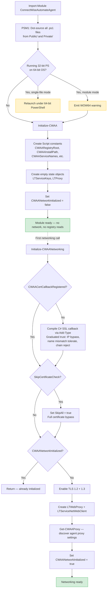
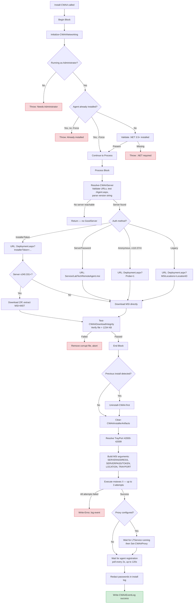
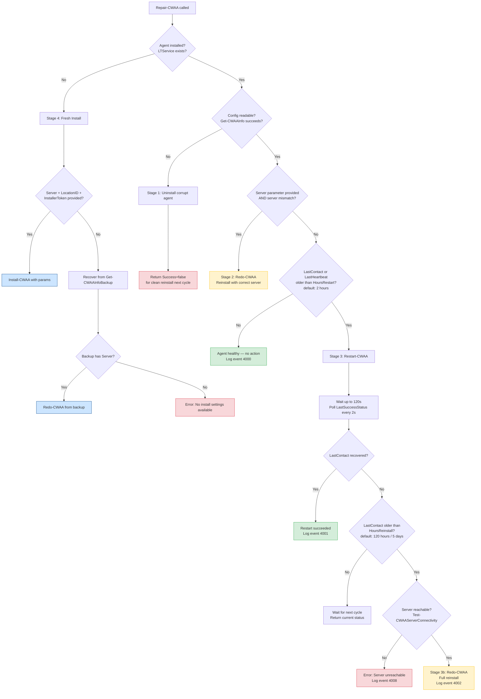
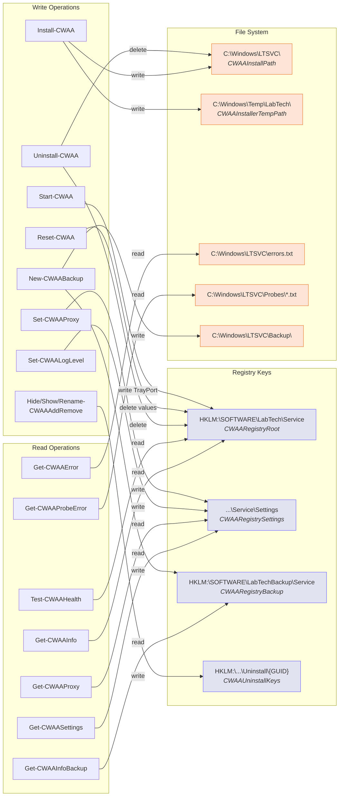
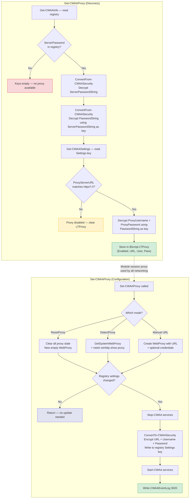

# ConnectWiseAutomateAgent Architecture

Visual reference for the module's internal structure, initialization flow, and system interactions.

## Module Initialization (Two-Phase)

Module import is fast with no side effects. Networking is deferred until first use.

## Agent Installation Workflow

`Install-CWAA` end-to-end flow from parameter validation through post-install verification.

## Health Check Escalation Flow

`Test-CWAAHealth` performs read-only assessment. `Repair-CWAA` uses those results to escalate remediation.

## Registry & File System Interaction Map

Which functions read and write the key system locations.

## Proxy Resolution Flow

`Get-CWAAProxy` discovers settings from the installed agent. `Set-CWAAProxy` applies changes with three modes.

## Uninstall/Cleanup Sequence

`Uninstall-CWAA` end-to-end flow from validation through post-uninstall verification.

```mermaid
flowchart TD
    A[Uninstall-CWAA called] --> B[Begin Block]
    B --> B1[Initialize-CWAANetworking]
    B1 --> B2{Running as<br/>Administrator?}
    B2 -->|No| B3[Throw: Needs Administrator]
    B2 -->|Yes| B4{Probe agent<br/>detected?}
    B4 -->|"Yes, no -Force"| B5[Error: Probe uninstall denied]
    B4 -->|"Yes, -Force"| B6[Continue]
    B4 -->|No| B6
    B6 --> B7{-Backup specified?}
    B7 -->|Yes| B8[New-CWAABackup]
    B7 -->|No| B9[Build registry key list<br/>30+ keys across HKLM,<br/>HKCR, HKU, Wow6432Node]
    B8 --> B9

    B9 --> C[Process Block]
    C --> C1{Server provided?}
    C1 -->|No| C2[Read from agent registry<br/>or prompt user]
    C1 -->|Yes| C3[Use provided server]
    C2 --> C3
    C3 --> C4[Resolve-CWAAServer<br/>Find first reachable server]
    C4 -->|No server| C5[Return — cannot proceed]
    C4 -->|Server found| C6[Download Agent_Uninstall.msi<br/>+ Agent_Uninstall.exe]
    C6 --> C7[Test-CWAADownloadIntegrity<br/>MSI > 1234 KB, EXE > 80 KB]
    C7 -->|Failed| C5
    C7 -->|Passed| C8[GoodServer set]

    C8 --> D[End Block]
    D --> D1[Stop-CWAA — stop all services]
    D1 --> D2[Kill agent processes<br/>from install path]
    D2 --> D3[regsvr32 /u wodVPN.dll]
    D3 --> D4[msiexec /x Agent_Uninstall.msi /qn]
    D4 --> D5[Execute Agent_Uninstall.exe]
    D5 --> D6["sc.exe delete — LTService,<br/>LTSvcMon, LabVNC"]
    D6 --> D7[Remove-CWAAFolderRecursive<br/>Install path + temp dir]
    D7 --> D8[Remove MSI file<br/>retry up to 4 times]
    D8 --> D9[Remove 30+ registry keys<br/>depth-first removal]
    D9 --> D10{Remnants<br/>detected?}
    D10 -->|Yes| D11[Error: Reboot recommended<br/>Event 1011]
    D10 -->|No| D12[Success: Agent uninstalled<br/>Event 1010]

    style B3 fill:#f8d7da,stroke:#dc3545
    style B5 fill:#f8d7da,stroke:#dc3545
    style C5 fill:#f8d7da,stroke:#dc3545
    style D11 fill:#fff3cd,stroke:#ffc107
    style D12 fill:#d4edda,stroke:#28a745
```

